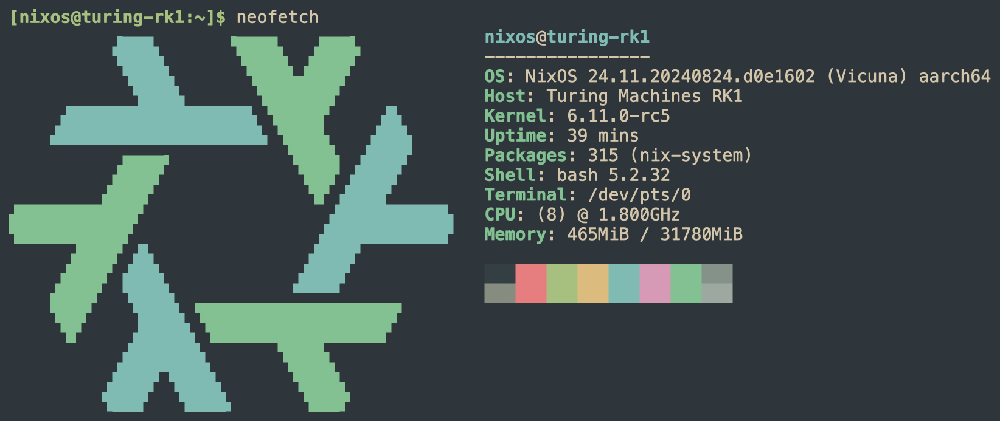

<div align="center"></div>
<h1 align="center">NixOS Turing RK1</h1>

This flake builds a bootable sd image to flash NixOS onto the [Turing RK1](https://turingpi.com/product/turing-rk1/). It builds everything from scratch* and uses the latest u-boot and kernel (`6.11.0-rc5`) from upstream.

> \* except for the closed-sourced BL31 and DDR binaries from Rockchip

## Features
- Fully reproducible: All custom configurations are included in this repository, with sources directly from upstream.
- Includes a patch that enables fan curve control (Thanks [@soxrok2212](https://github.com/soxrok2212)).

## Building the image
As of now, you have to be on an `aarch64-linux` system to build the flake. I'm in the process of adding cross-compilation support for `x86_64-linux` and hopefully `aarch64-darwin` too.

```bash
nix build github:GiyoMoon/nixos-turing-rk1#nixosConfigurations.turingrk1.config.system.build.sdImage
```

The created image can be found under `./result/sd-image/`.

Default credentials:
- username: `nixos`
- password: `turing`

## Updating a remote system
If you made changes to the flake and want to update your running system, you can copy the result to the remote system and switch to it.

On your local system:
```bash
nix build .#nixosConfigurations.turingrk1.config.system.build.toplevel
nix copy --to ssh://<username>@<nixos-host> ./result
```
On your NixOS system:
```bash
sudo /nix/store/<result-store-name>/bin/switch-to-configuration switch
```

If you have made changes to the kernel, restart your system for the changes to take effect.

## Todo's
- [ ] Add the Mali G610 firmware required for the GPU
- [ ] Fix kernel not logging to UART
- [ ] Support cross-compilation
  - [ ] x86_64-linux
  - [ ] aarch64-darwin

## Screenshots



## References
- [ryan4yin/nixos-rk3588](https://github.com/ryan4yin/nixos-rk3588)
- [Joshua-Riek/ubuntu-rockchip](https://github.com/Joshua-Riek/ubuntu-rockchip)
- [@soxrok2212](https://github.com/soxrok2212) created the fan curve patch
