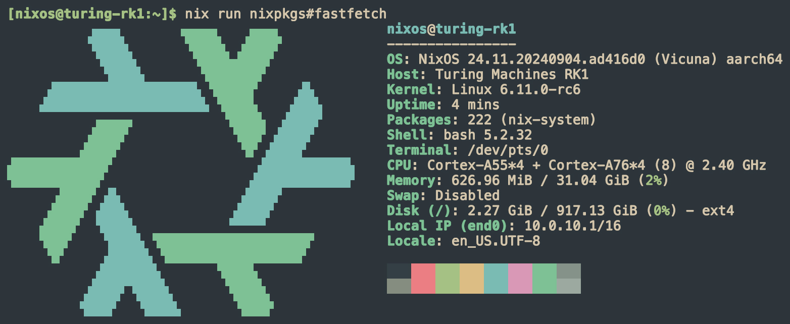

<div align="center"></div>
<h1 align="center">NixOS Turing RK1</h1>

This flake builds a bootable `nixosSystem` for the [Turing RK1](https://turingpi.com/product/turing-rk1/). It uses u-boot from nixpkgs and the mainline kernel (`6.12.0-rc1`) from upstream. It includes a patch that enables fan curve control (Thanks [@soxrok2212](https://github.com/soxrok2212)).

## Building the image
As of now, you have to be on an `aarch64-linux` system to build the flake. Adding support for cross-compilation on `x86_64-linux` is planned.

```bash
nix build github:GiyoMoon/nixos-turing-rk1#nixosConfigurations.turing-rk1.config.system.build.sdImage
```

The created image can be found under `./result/sd-image/`.

Default credentials:
- username: `nixos`
- password: `turing`

## Flake input

You can use this flake as a hardware config in your flake:

```nix
inputs = {
  turing-rk1 = {
    url = "github:GiyoMoon/nixos-turing-rk1";
  };
};
```

And then include `turing-rk1.nixosModules.turing-rk1` in your modules for your system.

## Flashing the image to an external block device

While the RK1 supports booting off an external block device, uboot still needs to be on the eMMC to handle the boot process. You can download an image that only contains uboot from the [releases](https://github.com/GiyoMoon/nixos-turing-rk1/releases) page or build it yourself with:
```bash
nix build github:GiyoMoon/nixos-turing-rk1#uboot-turing-rk1
```
The image will be created under `./result/sd-image/uboot.img`.

Flashing the OS image to the external block device is a bit tricky too, as we can't use the BMC of the Turing Pi. We have to either flash it by using a third-party device or we first flash NixOS onto the eMMC, flash the image to the external block device from within the RK1, then wipe the eMMC again with the small image that only contains uboot. I didn't want to open my case again to get the NVMe drives out, so I went with the latter, let's go through the steps:

1. Flash the `nixos.img` image (Download from releases or build yourself) onto the eMMC over the BMC User Interface
2. Power on the node
3. Copy `nixos.img` to the node:
```bash
scp nixos.img nixos@{NODE_IP}:/home/nixos/
```
4. SSH into the node and flash the image on the external block device. I'm flashing it to the NVMe drive under `/dev/nvme0n1`
```bash
sudo dd if=nixos.img of=/dev/nvme0n1 bs=4M status=progress oflag=sync
sudo sync
```
5. Power off the node
6. Flash the `uboot.img` image (Download from releases or build yourself) onto the eMMC over the BMC User Interface

Done! We now have a clean NixOS install on the external block device. The eMMC only contains uboot which will boot from the external device.

## Todo's
- [ ] Add the Mali G610 firmware required for the GPU
- [ ] Support cross-compilation on x86_64-linux

## Screenshots



## References
- [ryan4yin/nixos-rk3588](https://github.com/ryan4yin/nixos-rk3588)
- [Joshua-Riek/ubuntu-rockchip](https://github.com/Joshua-Riek/ubuntu-rockchip)
- [@soxrok2212](https://github.com/soxrok2212) created the fan curve patch
